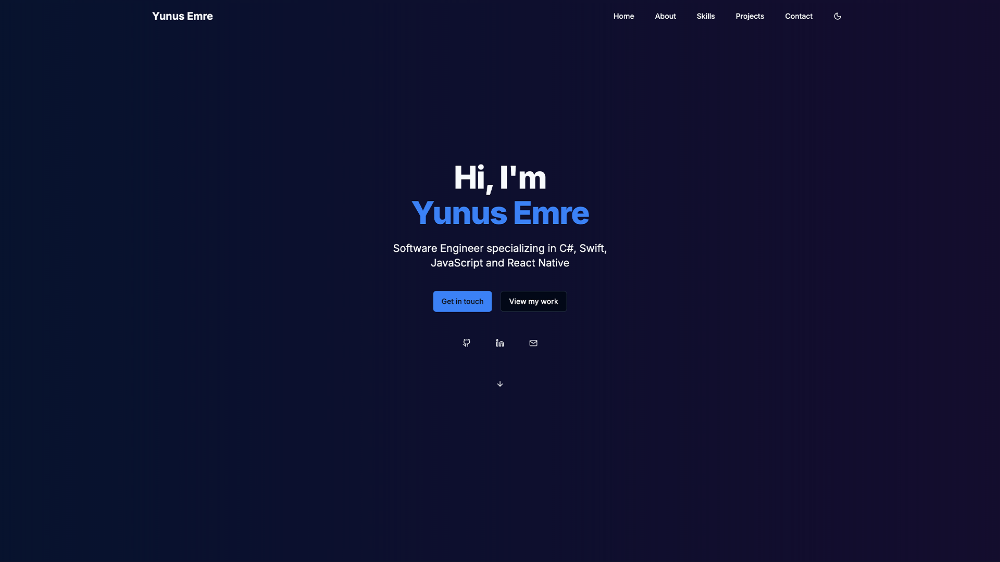
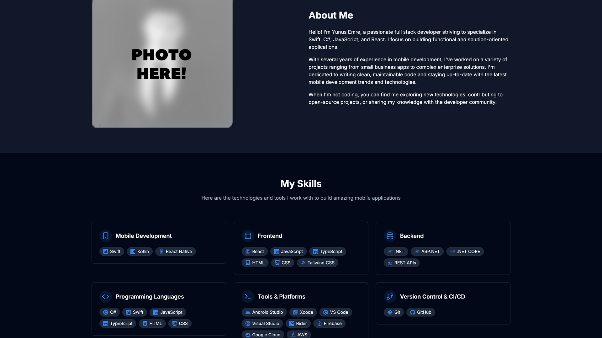
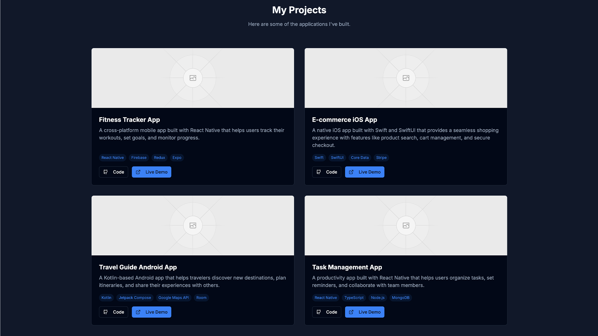

## ✨ Overview

**Modern Developer Portfolio** is a sleek, responsive, and minimalistic portfolio template built for developers who want to showcase their work and skills professionally. It is suitable for junior to senior developers looking to build a strong online presence.

---

## 🚀 Features

- Responsive design (desktop and mobile)
- Animated project cards
- Light/dark theme toggle
- Contact section with email and social links
- Smooth navigation and modern layout

---

## 🧰 Tech Stack

- **TypeScript**
- **React**
- **Next.js**
- **Tailwind CSS**
- **Vercel** (deployment)
- **Git & GitHub**

---

## 📸 Screenshots

<p float="left">
  
  
  
  
</p>

---

## 📦 Installation

```bash
git clone https://github.com/ynsemre1/modern-developer-portfolio.git
cd modern-developer-portfolio
npm install
npm run dev
